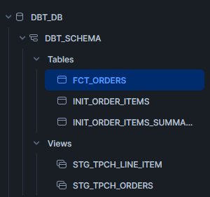
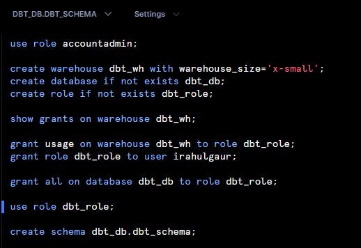

# Data Pipeline with Snowflake, dbt, and Airflow (Windows)

This repository demonstrates a data pipeline implementation using **Snowflake**, **dbt (Data Build Tool)**, and **Apache Airflow** on a Windows environment. The setup showcases how to process and transform data efficiently using these modern data tools.

---

## 📌 Project Overview

The pipeline consists of the following components:

- **Snowflake**: Acts as the data warehouse where tables, views, and schemas are managed.
- **dbt (Data Build Tool)**: Used for transforming raw data into meaningful datasets.
- **Apache Airflow**: Manages and schedules the workflow of the pipeline.

---

## 🗄️ Database Schema Structure

The Snowflake schema used in this project includes the following:

### **Tables**
- `FCT_ORDERS`
- `INIT_ORDER_ITEMS`
- `INIT_ORDER_ITEMS_SUMMARY`

### **Views**
- `STG_TPCH_LINE_ITEM`
- `STG_TPCH_ORDERS`

**Example Snowflake Schema:**



---

## ⚙️ Setup Instructions

### **Prerequisites**
Ensure you have the following installed on your Windows system:

- Snowflake account
- Python 3.8+
- dbt (install via `pip install dbt-snowflake`)
- Apache Airflow (install via `pip install apache-airflow`)

---

## 🔹 Step 1: Snowflake Configuration

Run the following SQL script in Snowflake to set up the warehouse, database, and schema:

```sql
USE ROLE accountadmin;

CREATE WAREHOUSE dbt_wh WITH WAREHOUSE_SIZE = 'x-small';
CREATE DATABASE IF NOT EXISTS dbt_db;
CREATE ROLE IF NOT EXISTS dbt_role;

GRANT USAGE ON WAREHOUSE dbt_wh TO ROLE dbt_role;
GRANT ROLE dbt_role TO USER irahulgaur;
GRANT ALL ON DATABASE dbt_db TO ROLE dbt_role;

USE ROLE dbt_role;
CREATE SCHEMA dbt_db.dbt_schema;
```

**Example Execution in Snowflake:**



---

## 🔹 Step 2: dbt Setup

1. Initialize a dbt project:
   ```sh
   dbt init my_dbt_project
   ```
2. Configure `profiles.yml` to connect dbt to Snowflake.
3. Run dbt models:
   ```sh
   dbt run
   ```

---

## 🔹 Step 3: Airflow Setup

1. Set up an Airflow DAG to automate dbt transformations.
2. Use `BashOperator` or `PythonOperator` to run dbt commands.
3. Start the Airflow webserver:
   ```sh
   airflow webserver -p 8080
   ```
4. Start the Airflow scheduler:
   ```sh
   airflow scheduler
   ```
5. Monitor DAG execution in the **Airflow UI**.

---

## 📂 Repository Structure

```
📦 data-pipeline-snowflake-dbt
├── dags/                # Airflow DAGs
├── dbt/                 # dbt models and configurations
├── scripts/             # Snowflake SQL scripts
├── README.md            # Documentation
```

---

## 🚀 Future Enhancements

- Implement more advanced dbt models.
- Add logging and monitoring for better pipeline visibility.
- Integrate with **cloud-based orchestration solutions**.

---

## 👤 Author

Developed by **[irahulgaur](https://github.com/iRahulGaur)**.

---

## 📜 License

This project is licensed under the **MIT License**.
